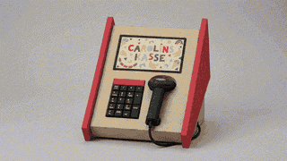
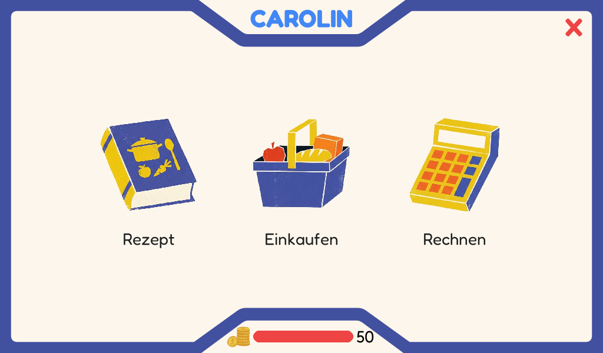
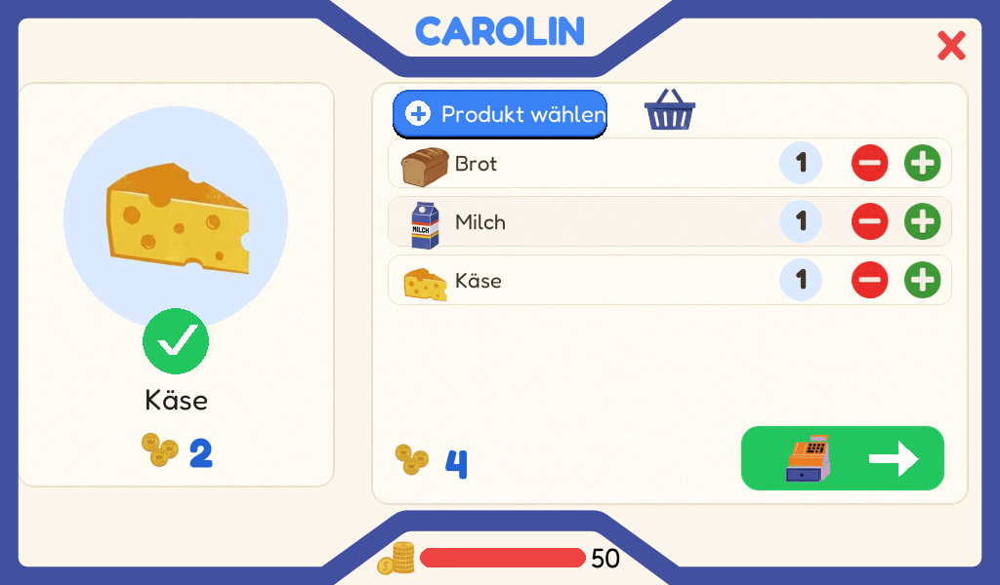
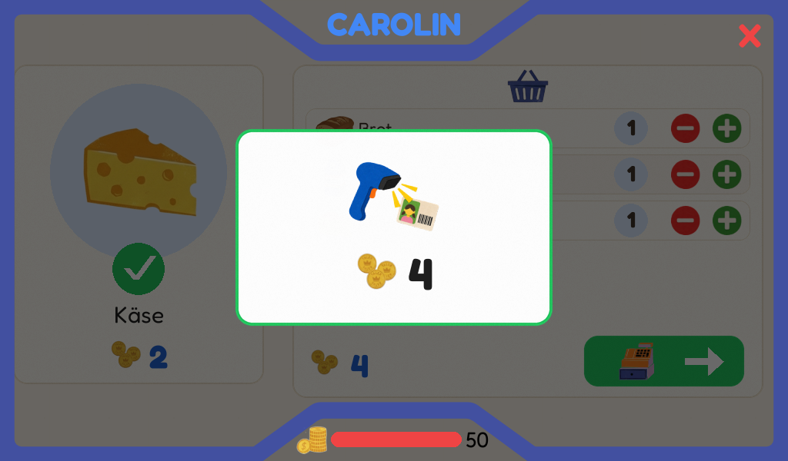
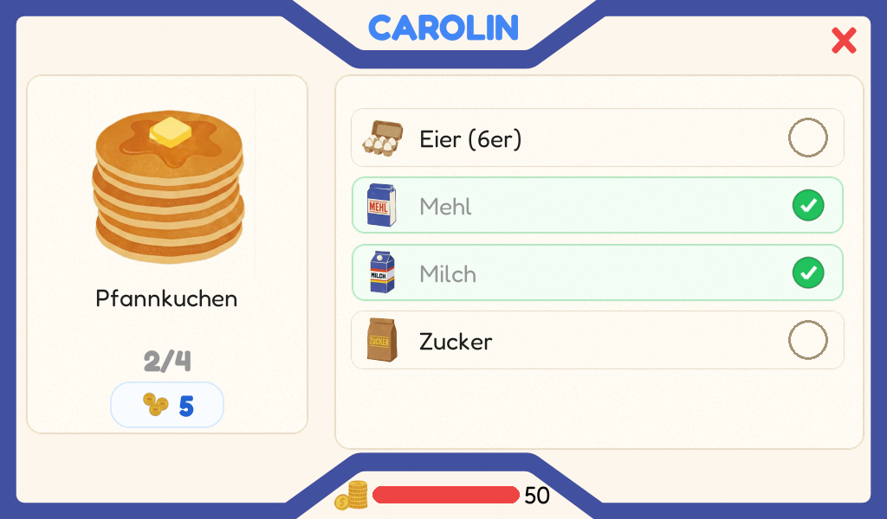
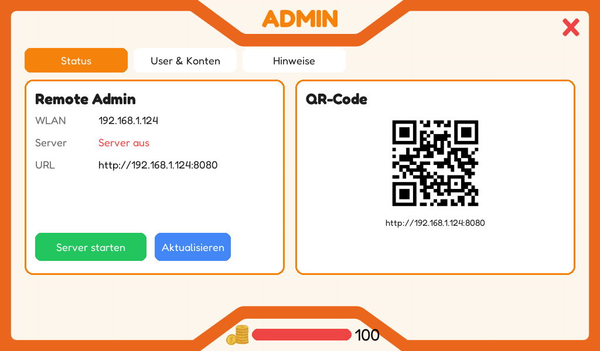

# Carolin's Kasse

A DIY self-checkout register for Carolin and Annelie, built around a real
barcode scanner, a 1024x600 touch display, and a Raspberry Pi Zero 2 W. Children
can shop, follow recipes, and earn Taler by solving math problems. The kiosk
interface is intentionally simple and remains in German.



## What Works

- Login with printed EAN-13 child cards
- Shopping with a barcode scanner or touch-based product picker
- Cart, balance, checkout, and child-friendly feedback
- Recipe cards with ingredient and quantity tracking
- Math exercises with per-child difficulty and Taler rewards
- Local accounts, sessions, earnings, and purchases in SQLite
- Parent controls on the kiosk and through a browser on the home network
- Printable user cards, recipe cards, product labels, and barcode files
- Automatic kiosk startup, backups, and guarded updates on Raspberry Pi

The normal play experience runs entirely on the local device and does not
require a cloud service.

## The Interface

These are genuine screenshots from the current 1024x600 pygame interface.



| Shopping cart | Customer card checkout |
|---|---|
|  |  |

| Recipe progress | On-device parent area |
|---|---|
|  |  |

## Shopping Flow

1. Scan a child card to open the cashier profile.
2. Choose **Einkaufen**, **Rezept**, or **Rechnen** from the main menu.
3. Scan products or add products without labels through the touch picker.
4. Review the cart and press the green checkout button.
5. Scan the customer's card. For self-checkout, this may be the same card used
   for login; the newly scanned card is the account that gets charged.
6. The purchase and updated balance are committed together, then the receipt is
   shown.

Recipe mode starts by scanning a recipe card and then tracks the required
ingredients and quantities. Math mode rewards correct answers while filtering
fast scanner input from ordinary number entry.

## Hardware

| Part | Model |
|---|---|
| Computer | Raspberry Pi Zero 2 W |
| Display | Elecrow 7-inch IPS Touch, 1024x600 |
| Power | Anker 20K 87W |
| USB hub | SEENGREAT Pi USB HUB Rev1.1 |
| Scanner | USB barcode scanner |
| Input | Touch display and USB number pad |
| Case | Custom wooden housing |

The Pi Zero 2 W has a single USB data bus. When the SEENGREAT shield is in Pi
Zero hub mode, leave the Pi's micro-USB data port unused and connect the touch
display, scanner, and number pad through the shield.

## Local Setup

The project requires [uv](https://docs.astral.sh/uv/) and Python 3.13 or newer.

```bash
git clone https://github.com/dweigend/carolins-kasse.git
cd carolins-kasse
uv sync --locked
uv run python tools/seed_database.py
uv run python tools/generate_barcodes.py
uv run python main.py
```

The kiosk uses a fixed 1024x600 resolution. On an empty installation,
`tools/seed_database.py` creates 40 products, 18 inventoried packaging barcode
aliases, the Carolin, Annelie, Gast, and Admin accounts, and five recipes. The
command is non-destructive by default and refuses to overwrite existing runtime
records.

> `uv run python tools/seed_database.py --reset` intentionally discards local
> balances, sessions, earnings, and purchases. Use it only for a deliberate
> rebuild.

## Parent and Admin Tools

Scanning the Admin card `2000000000046` opens the parent area on the kiosk. It
can start or stop the browser admin, show its address as a QR code, adjust
balances, and display account information.

Start the browser admin locally with:

```bash
uv run uvicorn src.admin.server:app --reload --port 8080
```

To open it from a phone on the same home network, bind it to all local
interfaces:

```bash
uv run uvicorn src.admin.server:app --host 0.0.0.0 --port 8080
```

Mutating browser actions require the local PIN-protected admin session and CSRF
tokens. The browser admin is intended for a trusted home network and should not
be exposed directly to the internet.

### Product Inventory

For occasional inventory work with a scanner connected to a Mac, start the
loopback-only workspace:

```bash
uv run python tools/run_inventory.py
```

It can add local products, assign or remove packaging barcodes, test scans, and
synchronize an explicit selection to the Pi with its admin PIN. Packaging
barcodes are stored as aliases of a stable internal product barcode. Product
images are not synchronized through this page; add them under
`assets/340er/<english_slug>.png` and deliver them through the normal Git update
path.

### Cards and Product Labels

```bash
# Generate all standard printable PDFs
uv run python tools/generate_printables.py

# Generate cards for selected users
uv run python tools/generate_printables.py --users Carolin Annelie

# Generate selected product labels, optionally with multiple copies
uv run python tools/generate_printables.py --products Brot Mehl Zucker
uv run python tools/generate_printables.py --products Brot=3 Mehl=2
uv run python tools/generate_printables.py --all-products
uv run python tools/generate_printables.py --products-without-packaging-barcode --barcode-only

# Generate a calibration sheet or continue a partly used sheet at position 7
uv run python tools/generate_printables.py --calibration
uv run python tools/generate_printables.py --products Brot=3 --start-position 7
```

Generated PDFs are written to `data/print/`; individual EAN-13 barcode files
are written to `data/barcodes/`.

Product labels use the Avery Zweckform 3490 layout with 24 labels measuring
70 x 36 mm on A4. `--x-offset-mm` and `--y-offset-mm` provide printer alignment
corrections. Print at 100 percent or "Actual Size" and verify the calibration
sheet on plain paper first.

`--products-without-packaging-barcode` selects active products that do not have
a packaging alias in the local inventory database. `--barcode-only` can be
combined with any product selection and creates a compact typewriter caption
with the product name and Taler price above the canonical EAN-13 barcode. The
barcode keeps 8 mm of trimming space in addition to its quiet zone.

## Barcode Model

| Prefix | Record type |
|---|---|
| `100` | Products |
| `200` | Users |
| `300` | Recipes |

`src/utils/barcodes.py` owns internal EAN-13 generation, check digits, file
paths, and admin URLs. Existing packaging codes remain unchanged and map to the
canonical internal product through `product_barcode_aliases`, keeping recipe
references stable.

## Raspberry Pi

The target is Raspberry Pi OS Lite 64-bit on a Raspberry Pi Zero 2 W. The
first-boot path installs the application under `/opt/carolins-kasse`, starts the
kiosk with systemd, and stores the runtime database outside the checkout at
`/var/lib/carolins-kasse/kasse.db` so balances and sessions survive updates.

See [docs/PI_SETUP.md](docs/PI_SETUP.md) for SD card preparation, first boot,
services, updates, backups, and hardware smoke tests.

## Quality Checks

Run the complete local check with:

```bash
uv run --locked tools/check.py
```

The Python check script verifies formatting and linting with Ruff, checks types
with `ty`, and runs the 112 standard-library `unittest` tests. Tests use
temporary SQLite databases and must not modify `data/kasse.db`.

Changes that affect the kiosk still require manual validation on real hardware,
especially touch input, scanner input, number-pad input, fullscreen rendering,
and startup performance.

## Project Status

The final physical checkout is built and operational. The project has moved
from core construction into fine-tuning: adding more products, replacing the
remaining missing or temporary graphics, and polishing individual interactions.

The next iterations will be guided by children using the checkout in practice.
Their behavior and feedback will show which functions are intuitive and fun,
which ones need adjustment, and where the experience can be simplified or
improved.
