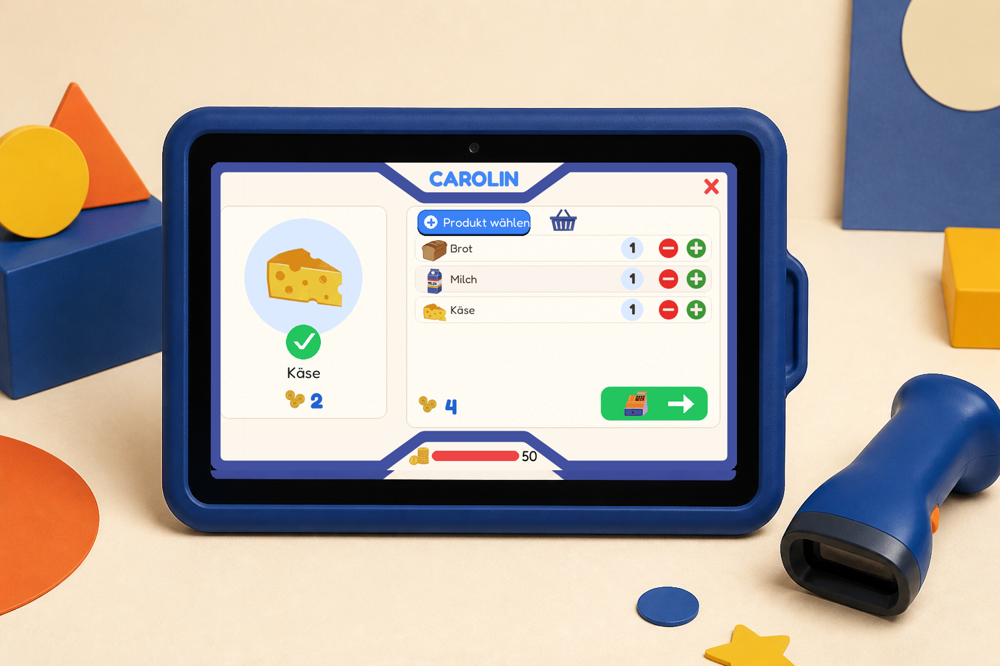

# Carolin's Kasse

Eine spielbare Kinderkasse für den Raspberry Pi: Karte scannen, einkaufen,
Rezepte erfüllen und mit Rechenaufgaben Taler verdienen. Die Anwendung verbindet
einen echten Barcode-Scanner und ein 1024×600-Touchdisplay mit einer bewusst
einfachen, deutschsprachigen Oberfläche für Carolin und Annelie.



*Referenzbasierte Illustration. Der Bildschirm zeigt einen echten Screenshot
der aktuellen 1024×600-App; Gerät und Umgebung sind illustriert.*

## Was die Kasse kann

- Anmeldung mit gedruckten EAN-13-Kinderkarten
- Einkaufen per Barcode-Scanner oder Touch-Produktauswahl
- Warenkorb, Kontostand, Bezahlung und verständliche Rückmeldungen
- Rezeptmodus mit Rezeptkarten, Zutaten und benötigten Mengen
- Rechenmodus mit kindgerechten Schwierigkeitsstufen und Taler-Belohnungen
- Lokale Konten, Sitzungen, Einnahmen und Einkäufe in SQLite
- Elternbereich direkt an der Kasse sowie im Browser im Heimnetz
- SVG-Barcodes und druckfertige A4-PDFs für Karten, Rezepte und Produkte
- Automatischer Kioskstart, Backups und sichere Updates auf dem Raspberry Pi

Die Kasse läuft vollständig lokal. Für den normalen Spielbetrieb ist kein
Cloud-Dienst erforderlich.

## Die echte Oberfläche

Das Hauptmenü führt direkt zu Rezept, Einkauf und Rechnen. Alle folgenden
Bilder sind echte Screenshots der aktuellen pygame-App, lokal mit dem
Produktions-Rendering in 1024×600 aufgenommen.


| Einkauf und Warenkorb | Bezahlen: Kund*innenkarte scannen |
|---|---|
|  |  |

| Rezept mit Zutatenfortschritt | Elternbereich am Gerät |
|---|---|
|  |  |

## So läuft ein Einkauf ab

1. Kinderkarte scannen und das persönliche Kassiererprofil öffnen.
2. Im Hauptmenü **Einkaufen**, **Rezept** oder **Rechnen** wählen.
3. Produkte scannen; Produkte ohne eigenes Etikett über die Touch-Auswahl ergänzen.
4. Mengen im Warenkorb prüfen und die grüne Bezahltaste berühren.
5. Die Kund*innenkarte scannen. Bei einem Selbsteinkauf kann das dieselbe Karte
   wie bei der Anmeldung sein; belastet wird das Guthaben der jetzt gescannten
   Karte.
6. Die Kasse speichert Einkauf und neuen Kontostand gemeinsam in SQLite und
   zeigt den Beleg an.

Im Rezeptmodus wird zuerst eine Rezeptkarte gescannt. Danach hakt die Kasse die
benötigten Zutaten und Mengen beim Scannen ab. Im Rechenmodus werden gelöste
Aufgaben mit Talern belohnt; schnelle Scanner-Eingaben werden dabei von normalen
Zahleneingaben getrennt.

## Schnellstart für die lokale Entwicklung

Vorausgesetzt werden [uv](https://docs.astral.sh/uv/) und eine von `uv`
verwendbare Python-Version ab 3.13.

```bash
cd carolins_kasse
uv sync
uv run python tools/seed_database.py
uv run python tools/generate_barcodes.py
uv run python main.py
```

Das Kioskfenster verwendet die feste Zielauflösung 1024×600. Beim ersten
Einrichten legt `tools/seed_database.py` 32 Produkte, die Konten Carolin,
Annelie, Gast und Admin sowie fünf Rezepte an. Der Befehl ist standardmäßig
nicht destruktiv und überschreibt keine vorhandenen Laufzeitdaten.

> `uv run python tools/seed_database.py --reset` verwirft bewusst Kontostände,
> Sitzungen, Einnahmen und Einkäufe. Nur für einen gewollten Neuaufbau verwenden.

### Browser-Admin lokal starten

```bash
uv run uvicorn src.admin.server:app --reload --port 8080
```

Danach ist der Admin unter <http://localhost:8080> erreichbar. Für ein Telefon
im selben Heimnetz bindet der Server an alle lokalen Schnittstellen:

```bash
uv run uvicorn src.admin.server:app --host 0.0.0.0 --port 8080
```

Schreibende Browser-Aktionen benötigen eine PIN-geschützte Admin-Sitzung und
CSRF-Schutz. Der Raspberry-Pi-Installer richtet die lokale PIN automatisch ein;
der Admin ist für das vertrauenswürdige Heimnetz gedacht und sollte nicht direkt
ins Internet gestellt werden.

Für die einmalige Produktinventur mit einem am Mac angeschlossenen Scanner gibt
es einen ausdrücklich lokalen Modus:

```bash
uv run python tools/run_inventory.py
```

Die Inventarseite läuft nur auf `127.0.0.1`. Dort lassen sich vorhandene
Verpackungscodes als zusätzliche Produktcodes erfassen, neue Produkte vormerken
und ausgewählte Einträge PIN-geschützt zur Kasse synchronisieren. Bilder werden
nicht über diese Seite übertragen: neue Produktbilder gehören als
`assets/340er/<english_slug>.png` in den normalen Git-/Update-Ablauf.

### Karten und Etiketten erzeugen

```bash
# Alle Standard-Druckbögen
uv run python tools/generate_printables.py

# Nur ausgewählte Kinderkarten
uv run python tools/generate_printables.py --users Carolin Annelie

# Ausgewählte oder alle Zweckform-3490-Produktetiketten
uv run python tools/generate_printables.py --products Brot Mehl Zucker
uv run python tools/generate_printables.py --products Brot=3 Mehl=2
uv run python tools/generate_printables.py --all-products

# 3490-Kalibrierbogen und ein angebrochener Bogen ab Position 7
uv run python tools/generate_printables.py --calibration
uv run python tools/generate_printables.py --products Brot=3 --start-position 7
```

Die PDFs werden unter `data/print/` abgelegt, die einzelnen EAN-13-Barcodes
unter `data/barcodes/`.

Produktetiketten verwenden das Avery-Zweckform-3490-Raster mit 24 Etiketten à
70 × 36 mm. Bei Bedarf verschieben `--x-offset-mm` und `--y-offset-mm` den
Ausdruck. Im macOS-Druckmenü immer `100 %` beziehungsweise „Tatsächliche Größe“
verwenden und zunächst den Kalibrierbogen auf Normalpapier prüfen.

Das interne Barcode-Schema verwendet eindeutige Präfixe: `100` für Produkte,
`200` für Benutzerkarten und `300` für Rezepte. Prüfziffern, Dateipfade und
Admin-URLs werden zentral in `src/utils/barcodes.py` erzeugt. Bereits auf
Verpackungen vorhandene Codes bleiben unverändert und werden als zusätzliche
Aliase einem stabilen internen Produktcode zugeordnet.

## Elternbereich

Die Admin-Karte `2000000000046` öffnet den Elternbereich auf dem Touchdisplay.
Dort lassen sich der Browser-Admin starten, dessen Adresse als QR-Code anzeigen,
Kontostände anpassen und Konten überblicken.

Der Browser-Admin ergänzt die Bedienung am Gerät:

- Produkte, Preise und Aktivstatus verwalten
- Konten, Schwierigkeitsstufen und Guthaben verwalten
- Rezepte und Zutaten einsehen, Rezepte aktivieren oder deaktivieren
- Barcodes öffnen und A4-Druckbögen erzeugen
- auf dem Pi Dienststatus, kurze Logs und Backups prüfen
- PIN-geschützt Backup, Neustart oder Update anstoßen

## Raspberry Pi

Das Zielsystem ist ein Raspberry Pi Zero 2 W mit Raspberry Pi OS Lite 64-bit.
Der vorbereitete Erststart installiert das Projekt nach `/opt/carolins-kasse`,
startet den Kiosk über systemd und hält die Laufzeitdatenbank updatefest unter
`/var/lib/carolins-kasse/kasse.db`.

Die vollständige Anleitung für SD-Karte, Erststart, Dienste, Updates, Backups
und Hardware-Smoke-Test steht in [docs/PI_SETUP.md](docs/PI_SETUP.md).

Wichtig für den aktuellen SEENGREAT Pi USB HUB: Im Pi-Zero-Hub-Modus bleibt der
Micro-USB-Datenport des Pi frei. Touch, Scanner und Nummernblock werden gemeinsam
am Shield angeschlossen, da beide Anschlusspfade denselben USB-Datenbus nutzen.

## Architektur

```text
Barcode-Scanner / Touch / Nummernblock
                  │
                  ▼
         pygame-Kiosk (`main.py`)
        ├─ Szenen und UI-Komponenten
        ├─ gemeinsamer Rahmen und Zustand
        └─ öffentliche Datenbank-API
                  │
                  ▼
             lokale SQLite-DB
                  ▲
                  │
         FastAPI-Browser-Admin
```

| Bereich | Verantwortung |
|---|---|
| `src/scenes/` | Anmeldung, Menü, Einkauf, Produktauswahl, Rezepte, Rechnen und Geräte-Admin |
| `src/components/` | Wiederverwendbare pygame-Bausteine |
| `src/ui/` | Gemeinsamer 1024×600-Rahmen und Rendering-Hilfen |
| `src/admin/` | FastAPI-App, Jinja2-Seiten und Admin-CSS |
| `src/utils/` | Zustand, SQLite, Barcodes, Assets, Netzwerk und Pi-Funktionen |
| `tools/` | Einrichtung, Barcode-/PDF-Erzeugung und Pi-Betrieb |
| `systemd/` | Kiosk-, Update-, Backup- und Installationsdienste |
| `tests/` | Isolierte Regressionstests mit temporären Datenbanken |

`src/utils/database.py` bleibt die öffentliche SQLite-Schnittstelle. Die
fachlichen SQL-Helfer sind nach Produkten, Rezepten, Konten, Sitzungen,
Einnahmen, Transaktionen und Checkout getrennt. Checkout und Kontostand werden
atomar geschrieben, damit kein halber Einkauf zurückbleibt.

Weitere Details: [dev/ARCHITECTURE.md](dev/ARCHITECTURE.md).

## Tests und Qualität

Der vollständige lokale Qualitätslauf ist:

```bash
uv run poe check
```

Neben den mit `uv sync` installierten Entwicklungswerkzeugen wird dafür
[Bun](https://bun.sh/) benötigt, weil die Duplikatprüfung über `bunx` läuft.

Er prüft Formatierung und Linting mit Ruff, Typen mit `ty`, ungenutzten Code,
Abhängigkeiten, Duplikate und Komplexität und führt die pytest-Suite mit
Coverage aus. Die Tests verwenden temporäre SQLite-Datenbanken und sollen
`data/kasse.db` nicht verändern.

Für Änderungen am Kiosk bleiben zusätzlich manuelle Tests auf echter Hardware
wichtig: Touch, Scanner, Nummernblock, Vollbilddarstellung und Startzeit lassen
sich lokal nur unvollständig abbilden.

## Projektstatus

Der Funktionsumfang für den Spielbetrieb ist implementiert: Anmeldung,
Einkaufen, Produktauswahl, Checkout, Rezepte, Rechnen, Konten, Druckbögen und
beide Elternbereiche sind vorhanden. Die automatisierte Testsuite deckt die
zentralen Datenbank-, Sicherheits-, Szenen- und Pi-Betriebspfade ab.

Noch ausstehend sind vor allem Abnahmetests am realen Aufbau:

- Scanner-, Touch- und Nummernblock-Abläufe im vollständigen Kiosk
- Bedienbarkeit mit Kindern auf dem 1024×600-Display
- Startzeit und Darstellung auf dem Pi Zero 2 W
- ein weiterer vollständig automatischer Erststart ohne manuelle Nacharbeit

Aktueller Arbeitsstand und nächste Schritte stehen in
[dev/HANDOVER.md](dev/HANDOVER.md) und [dev/PLAN.md](dev/PLAN.md).
